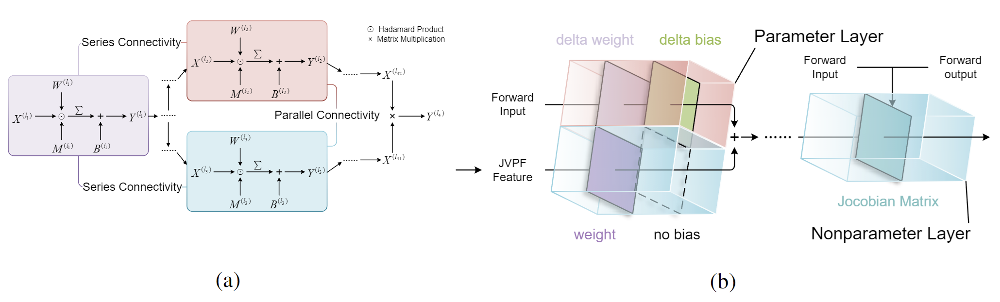

<h1 align="center"> Optimal Brain Apoptosis </h1>

<div align="center">

[Mingyuan Sun](https://myuansun.github.io/)<sup>1</sup>,
[Zheng Fang](http://faculty.neu.edu.cn/fangzheng)<sup>1†</sup>,
[Jiaxu Wang](https://github.com/Mercerai)<sup>2</sup>,
[Junjie Jiang](https://scholar.google.com/citations?hl=en&user=IaX-R6MAAAAJ)<sup>1</sup>,
[Delei Kong](https://scholar.google.com/citations?hl=en&user=c1uix3gAAAAJ)<sup>3</sup>,
[Chenming Hu](https://github.com/huchenming)<sup>1</sup>,

[Yuetong Fang](https://scholar.google.com/citations?hl=en&user=zgo7pswAAAAJ)<sup>2</sup>
and [Renjing Xu](https://scholar.google.com/citations?user=Mu__bJEAAAAJ&hl=en)<sup>2†</sup>

<sup>1</sup> Northeastern University, <sup>2</sup> The Hong Kong University of Science and Technology (Guangzhou), <sup>3</sup> Hunan University.        
(†) Corresponding authors.

[](https://arxiv.org/abs/2502.17941)
</div>

## Absract

The increasing complexity and parameter count of Convolutional Neural Networks (CNNs) and Transformers pose challenges in terms of computational efficiency and resource demands. Pruning has been identified as an effective strategy to address these challenges by removing redundant elements such as neurons, channels, or connections, thereby enhancing computational efficiency without heavily compromising performance. This paper builds on the foundational work of Optimal Brain Damage (OBD) by advancing the methodology of parameter importance estimation using the Hessian matrix. Unlike previous approaches that rely on approximations, we introduce Optimal Brain Apoptosis (OBA), a novel pruning method that calculates the Hessian-vector product value directly for each parameter. By decomposing the Hessian matrix across network layers and identifying conditions under which inter-layer Hessian submatrices are non-zero, we propose a highly efficient technique for computing the second-order Taylor expansion of parameters. This approach allows for a more precise pruning process, particularly in the context of CNNs and Transformers, as validated in our experiments including VGG19, ResNet32, ResNet50, and ViT-B/16 on CIFAR10, CIFAR100, and Imagenet datasets.

## Overview

<p align="center">
    
</p>

Instead of approximating Hessian matrix, we calculate the Hessian-vector product element $\sum_{j}\frac{\partial^2 \mathcal{L}}{\partial\theta_i\partial\theta_j}\delta\theta_i\delta\theta_j$ for each parameter in the network. To achieve this, we first separate the Hessian matrix of the whole network into Hessian submatrices between layers. Then, in the context of widely used network structures including convolutional neural networks (CNNs) and Transformers, we analyze the conditions where the Hessian submatrices between two layers are nonzero, and summarize them as series connectivity and parallel connectivity. Finally, we propose a highly efficient method to capture these conditions and obtain the Hessian-vector product element on each parameter. Stepping from approximating the Hessian matrix with the Fisher matrix to directly computing the Hessian-vector product, OBA is a novel pruning method that efficiently calculates the second-order Taylor expansion for each parameter and is applicable to both structured and unstructured pruning tasks.

## Quickstart

### 1. Environment Setup
Our code is implemented on Python 3.11 with Pytorch 2.0.1 and CUDA 11.7. To reproduce and use our environment, you can use the following command:

```
git clone https://github.com/NEU-REAL/OBA.git
cd OBA
conda env create -f environment.yaml
conda activate oba
```

### 2. Dataset Setup
Please enter the dataset directory to CIFAR10, CIFAR100 and Imagent datasets in the ```dataset.yaml```. CIFAR10 and CIFAR100 can be automatically downloaded if you set a directory without the dataset, while regarding Imagenet you need to manually download it.

## Reproduce Experiments
### Structured Pruning Experiments
If you want to run the one-shot pruning experiments on CIFAR10 and CIFAR100, an example command is as follows:

```
python train_prune.py --importance_type OBA --dataset cifar10 --model vgg19 --ops_ratios 0.14
```

where ```ops_ratios``` represents the ratio of the target reserved FLOPs of the pruned model to that of the unpruned model.
_________________
To run the iterative pruning experiments on CIFAR10 and CIFAR100, an example command is as follows:

```
python iterative_prune.py --importance_type OBA --dataset cifar10 --model resnet32 --ops_ratios 0.6 0.5 0.4 0.3 0.2 0.1 0.05
```

where the ops_ratios should be decreasing.
_________________
To run the one-shot pruning experiments on Imagenet, an example command is as follows:

```
python prune_imagenet.py --importance_type OBA --model vit_b_16 --ops_ratios 0.51
```

Then you could use the following example command to finetune the pruned model:

```
python train_imagenet.py --save_dir directory_to_saved_model --model_name pruned_model
```

You can refer to ```prune_imagenet.py``` for the detailed value of ```save_dir``` and ```model_name```.

_________________
### Unstructured Pruning Experiments

An example command is as follows:

```
python train_unstructured_prune.py --importance_type OBA --dataset cifar10 --model resnet20 --pruning_ratio 0.1
```

in which ```pruning_ratio``` is the same to ```ops_ratio```.

## Acknowledgement

We would like to thank the authors of [Pytorch](https://pytorch.org/) for providing the open-source deep learning framework. We also appreciate the authors of [EigenDamage](https://github.com/alecwangcq/EigenDamage-Pytorch) and [Torch-pruning](https://github.com/VainF/Torch-Pruning) for their public code.

## Citation

If you find our repository useful, please consider citing us as
```
@inproceedings{
sun2025optimal,
title={Optimal Brain Apoptosis},
author={Mingyuan Sun and Zheng Fang and Jiaxu Wang and Junjie Jiang and Delei Kong and Chenming Hu and Yuetong Fang and Renjing Xu},
booktitle={The Thirteenth International Conference on Learning Representations},
year={2025},
url={https://openreview.net/forum?id=88rjm6AXoC}
}
```
